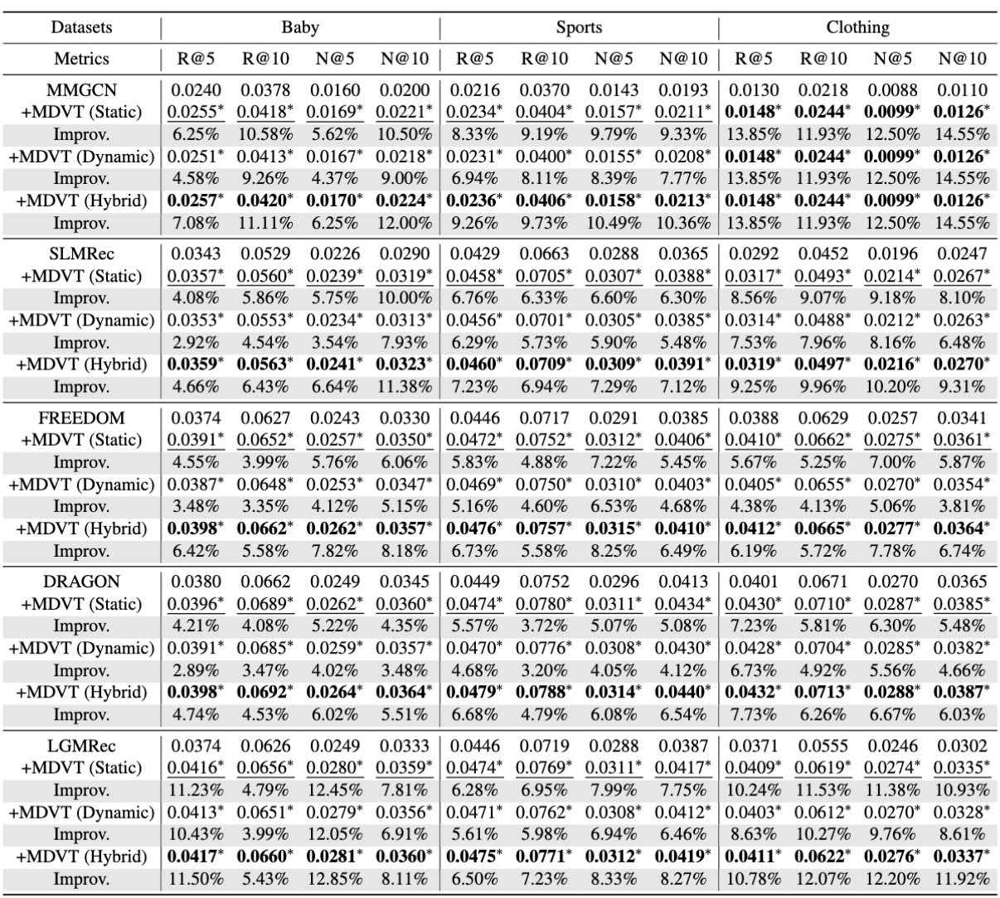

# MDVT: Enhancing Multimodal Recommendation with Model-Agnostic Multimodal-Driven Virtual Triplets

## Introduction

This is the Pytorch implementation for our MDVT paper:

>MDVT: Enhancing Multimodal Recommendation with Model-Agnostic Multimodal-Driven Virtual Triplets

## Environment Requirement
- python 3.9
- Pytorch 2.1.0

## Dataset

We utilize three distinct public multimodal recommendation datasets: Baby, Sports, Clothing

## Training
  ```
  cd ./src
  python main.py
  ```
*<u>Static strategies offer broad coverage but are costly. For some models, MDVT can cause significant fluctuations in their original optimal hyper-parameter settings, potentially requiring substantial hyper-parameter search costs to identify the new optimal settings.</u>*

## Performance Comparison



## Citing MDVT

If you find MDVT useful in your research, please consider citing our [paper]().

```

```


## Acknowledgement

The structure of this code is  based on [MMRec](https://github.com/enoche/MMRec). Thank for their work.